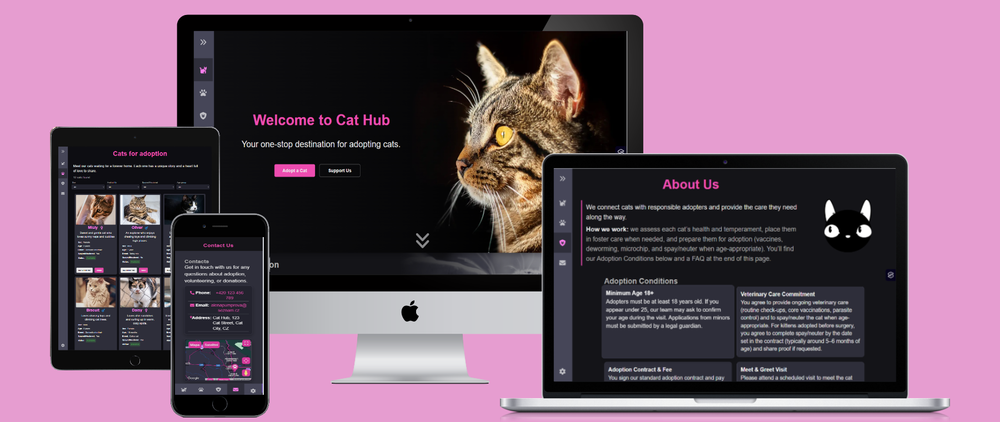
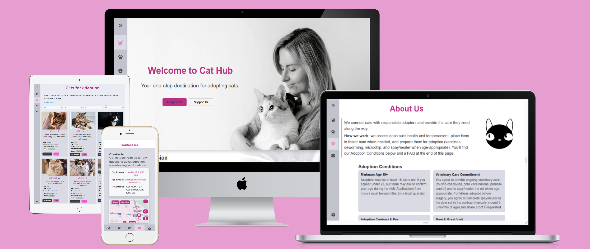

# 🐾 Cat Hub – React App for Cat Adoption

A **frontend-only React application** for cat adoption, deployed on **GitHub Pages**.  
The project focuses on **React, API integration, theming, accessibility and responsive design**.

🔗 Live demo: [https://alena0490.github.io/Cat-adoption-app/](https://alena0490.github.io/Cat-adoption-app/)
📂 Repository: [https://github.com/Alena0490/Cat-adoption-app](https://github.com/Alena0490/Cat-adoption-app)

---

## ✨ Features

- **Cat listings with filters** (gender, availability, castration, age group) – `src/pages/Cats.jsx`
- **Google Maps API** – custom marker (AdvancedMarker + Pin with paw icon) + **dynamic map styles** switching with light/dark theme – `src/pages/Contacts.jsx`
- **Google Pay (TEST)** – integrated donation button – `src/components/OneCat.jsx`
- **Settings sidebar** – theme switch (light/dark) + font scaling, persisted in `localStorage`
- **Responsive & accessible UI** – visible focus rings, keyboard navigation, aria roles, reduced motion respected
- **Routing with React Router** – Home / Cats / About / Contacts / 404 page

---

## 🧩 Implementation details

- **Theming** – handled via `html.light-theme` class + dynamic `mapId` (light/dark); `MutationObserver` synchronizes map style with UI.
- **Google Maps** – integrated with `@vis.gl/react-google-maps`, fallback message shown if API key is missing.
- **Google Pay** – implemented with `PaymentsClient({ environment: 'TEST' })`, demo gateway configuration.
- **UX & accessibility** – controlled focus in dialogs, background scroll lock when sidebars open, honeypot anti-spam field in forms.
- **Navigation** – responsive sidebar (desktop) / bottom navigation (mobile), active states via `NavLink`.

---

## 🔐 API Keys

- Uses a **browser API key** for Google Maps – visible in client-side code.  
  ➝ Must be **restricted** in Google Cloud Console (HTTP referrers + Maps JavaScript API restriction).  
- Key injected during build via **GitHub Secrets** (see code).

---

## 📂 Project structure (simplified)

src/
components/
AdoptionForm.jsx
FAQ.jsx / Question.jsx
Footer.jsx
Form.jsx
Menu.jsx
OneCat.jsx
SettingsSidebar.jsx / SettingsContent.jsx
pages/
Home.jsx
Cats.jsx
Contacts.jsx
About.jsx
Error.jsx
images/, styles (CSS), data.js
public/
index.html (theme init + pay.js, favicons, manifest)

---

## ♿ Accessibility

- Color contrast and typography aligned with WCAG 2.2 AA  
- Full keyboard navigation support  
- Focus traps and visible outlines in dialogs and sidebars  
- Reduced motion respected for animations

---

## 🚀 Roadmap (frontend only)

- Extend cat filters and detail view  
- Micro-interactions and improved loading/error states  
- Optimize image performance (sizes/srcset, lazy loading)  
- Further tuning of accessibility and responsive layouts

---

## 📜 License

MIT
